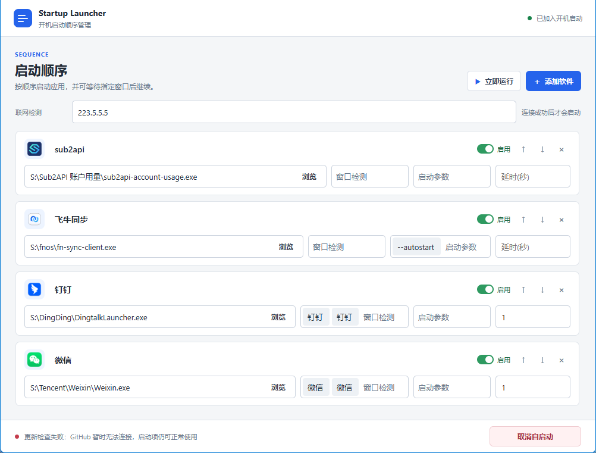

# Startup Launcher

按自定义顺序启动 Windows 应用，并根据网络状态和窗口状态控制启动流程。

## 功能

- 添加、删除、启用或停用启动项，并调整启动顺序。
- 为每个启动项设置应用路径和名称；选择应用后自动显示其程序图标。
- 为应用添加多个启动参数和窗口标题，按顺序检测目标窗口。
- 设置网络连接检测目标；网络连通后才开始执行启动项。
- 窗口检测支持按标题依次等待不同窗口。每个窗口最多等待 60 秒；检测完成后可延时关闭最后检测到的窗口。未设置窗口检测时，延时用于等待后启动下一项。
- 显示独立的启动进度窗口，展示应用图标、当前启动项和窗口等待倒计时；点击待启动项图标可跳转到该项。
- 将应用加入或移出当前 Windows 用户的开机启动，无需管理员权限。
- 启动流程完成后自动关闭进度窗口。
- 自动检查 GitHub 最新版本；确认更新后下载新版、替换当前程序并重启到设置界面。开机启动时会在启动项执行完成后检查更新。
- 设置和启动项保存在当前用户配置中，不受程序文件移动位置影响。

## 启动项设置

## 启动进度

